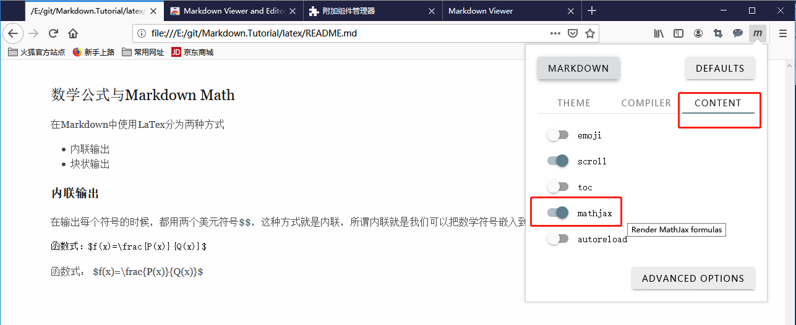

### 设置浏览器支持预览Markdown文件

我们可以通过网页浏览器预览本地或git网站(例如github)上的Markdown文件，
像github网站，本身就支持对Markdown文件的预览，但是并不支持LaTex公式的渲染，
而本地的Markdown文件如果用浏览器直接打开，也只会被当成普通文本文件显示，
所有这些都需要通过安装浏览器的扩展插件来实现。

#### 在浏览器中预览带LaTex公式Markdown文件

1. 安装并打开Markdown Viewer插件：

- Firefox参考https://www.jianshu.com/p/f50d670972fb

- Chrome在网上应用店里( https://chrome.google.com/webstore/category/extensions )里搜Markdown Viewer

2. 打开Mathjax选项：

#### github上预览带LaTex公式Markdown文件

默认的github，预览Markdown文件是不支持渲染LaTex公式的。

需要另行安装插件

- Firefox需要安装traversaro/github-mathjax-firefox，可以去github上搜，
  或者直接访问：https://github.com/traversaro/github-mathjax-firefox

- Chrome在网上应用店里( https://chrome.google.com/webstore/category/extensions )里搜MathJax Plugin for Github
